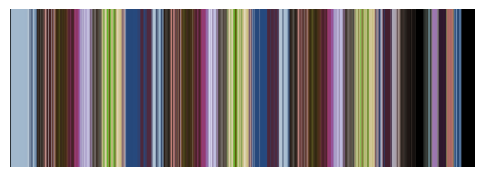
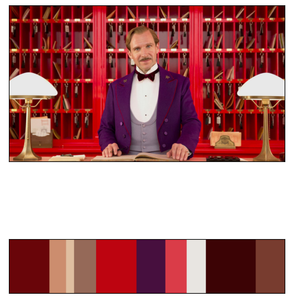

# barcode-generator
This program generates barcodes from entire movies.

This is a barcode generated from the short movie called Coffee Run, which has been made by Blender Studios.

  

It can extract color profiles from images. 

  

Usage: 
generator [-h] [-length LENGTH] [-colors COLORS] mode path

Generate a color profile of an entire movie or a particular scene

positional arguments:
  mode            use m to run the program to generate a barcode for movie, s to generate color-profile for a scene
  path            specify the path of the movie/scene

optional arguments:
  -h, --help      show this help message and exit
  -length LENGTH  optional argument, the length of the barcode
  -colors COLORS  optional argument, the number of primary colors to be found in the scene